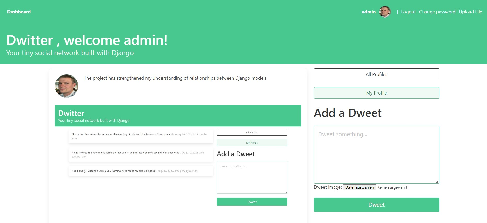
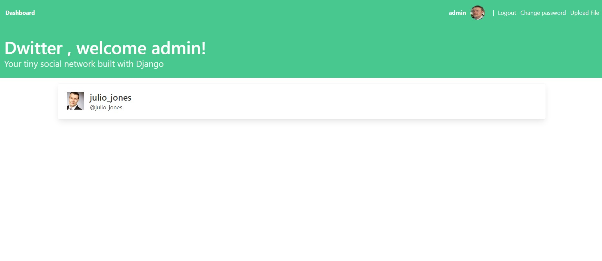
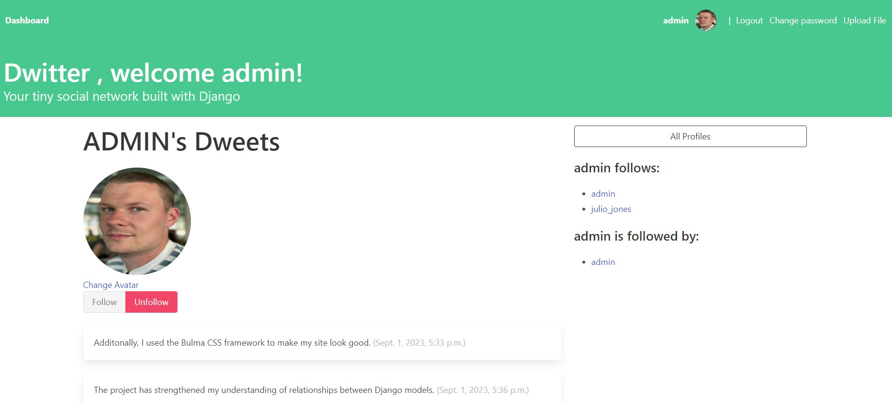

# Social Network build with Django

By following the tutorials on [Real Python](https://realpython.com/) I have successfully build a social network with Django.

Users are able to post and see their own dweets, as well the dweets of users that they are following.

Users can easily follow and unfollow other users.

The project has strengthened my understanding of relationships between Django models and showed me how to use forms so that users can interact with my app and with each other. 

I have additionally used the Bulma CSS framework to make my site look good.

The network includes a page for viewing all profiles:

The users can also view their profiles:

# What I have learned
## First Tutorial

- Implement one-to-one and many-to-many relationships between Django models
- Extend the Django user model with a custom Profile model
- Customize the Django admin interface

## Second Tutorial

- Integrate Bulma CSS and style your app
- Use template inheritance to reduce repetition
- Structure Django templates in a folder hierarchy
- Build routing and view functions
- Interlink pages of your app using dynamic URLs

## Third Tutorial

- Create the front-end interface to let users follow and unfollow profiles
- Submit and handle a POST request in Django using buttons
- Set up the model for your text-based content
- Build styled templates to display content on the front end
- Use intricate model relationships in template code

## Fourth Tutorial

- Create and render Django forms from your Dweet model
- Prevent double submissions and display helpful error messages
- Interlink pages of your app using dynamic URLs
- Refactor a view function
- Use QuerySet field lookups to filter your data on the back end

# I am comfortable with the following concepts:

- Using object-oriented programming in Python
- Setting up a basic Django project
- Managing routing and redirects, view functions, templates, models, and migrations in Django
- Using and customizing the Django Admin interface
- Reading and writing HTML with class attributes

# In the process of building this project, I’ve learned how to:

- Build a Django project from start to finish
- Implement OneToOne and ForeignKey relationships between Django models
- Extend the Django user model with a custom Profile model
- Customize the Django admin interface
- Integrate Bulma CSS to style my app
- Create the front-end interface to follow and unfollow profiles
- Submit and handle a POST request in Django using buttons
- Set up the model for my text-based content
- Build styled templates to display content on the front end
- Use intricate model relationships in template code

# Tutorial Steps Checklist

[Tutorial Part 1](https://realpython.com/django-social-network-1/)
- [ x ] [Step 1: Set Up the Base Project](https://realpython.com/django-social-network-1/#step-1-set-up-the-base-project)
    - [ x ] Create a virtual environment and install Django
    - [ x ] Create a Django project and app
    - [ x ] Customize the Django admin interface
    - [ x ] Create users for your app
- [ x ] [Step 2: Extend the Django User Model](https://realpython.com/django-social-network-1/#step-2-extend-the-django-user-model)
    - [ x ] Create a Profile Model
    - [ x ] Display Profile Information Within the User Admin Page
- [ x ] [Step 3: Implement a Post-Save Hook](https://realpython.com/django-social-network-1/#step-3-implement-a-post-save-hook)
    - [ x ] Coordinate Users and Profiles With a Signal
    - [ x ] Add Functionality Through Error-Driven Development
    - [ x ] Refactor Your Code Using a Decorator
    - [ x ] Confirm the Automatic Association in Your Admin

[Tutorial Part 2](https://realpython.com/django-social-front-end-2/)
- [ x ] [Step 4: Create a Base Template With Bulma](https://realpython.com/django-social-front-end-2/#step-4-create-a-base-template-with-bulma)
    - [ x ] Create a Base Template
    - [ x ] View Your Base Template
    - [ x ] Add Bulma CSS to Your Base Template
- [ x ] [Step 5: List All User Profiles on the Front End of Your Django App](https://realpython.com/django-social-front-end-2/#step-5-list-all-user-profiles-on-the-front-end-of-your-django-app)
    - [ x ] Write the Routes and Code Logic
    - [ x ] Write the Profile List Template
- [ x ] [Step 6: Access Individual Profile Pages](https://realpython.com/django-social-front-end-2/#step-6-access-individual-profile-pages)
    - [ x ] Build a Profile Page Template
    - [ x ] Link the Profile Pages

[Tutorial Part 3](https://realpython.com/django-social-post-3/)
- [ x ] [Step 7: Follow and Unfollow Other Profiles](https://realpython.com/django-social-post-3/#step-7-follow-and-unfollow-other-profiles)
    - [ x ] Add Buttons to Your Profiles
    - [ x ] Handle POST Requests in Django Code Logic
- [ x ] [Step 8: Create the Back-End Logic For Dweets](https://realpython.com/django-social-post-3/#step-8-create-the-back-end-logic-for-dweets)
    - [ x ] Make the Model
    - [ x ] Add Dweets Through the Admin Interface
- [ x ] [Step 9: Display Dweets on the Front End](https://realpython.com/django-social-post-3/#step-9-display-dweets-on-the-front-end)
    - [ x ] Display Personal Dweets on Each Profile Page
    - [ x ] Create a Dashboard View

[Tutorial Part 4](https://realpython.com/django-social-forms-4/)
- [ x ] [Step 10: Submit Dweets Using Django Forms](https://realpython.com/django-social-forms-4/#step-10-submit-dweets-using-django-forms)
    - [ x ] Create a Text Input Form
    - [ x ] Render the Form in Your Template
    - [ x ] Make Form Submissions Possible
- [ x ] [Step 11: Prevent Double Submissions and Handle Errors](https://realpython.com/django-social-forms-4/#step-11-prevent-double-submissions-and-handle-errors)
    - [ x ] Prevent Double Submissions
    - [ x ] Handle Submission Errors
- [ x ] [Step 12: Improve the Front-End User Experience](https://realpython.com/django-social-forms-4/#step-12-improve-the-front-end-user-experience)
    - [ x ] Improve the Navigation
    - [ x ] Sort the Dweets

# Coming Up
- Implement User Authentication: Allow new users to sign up through the front end of your web app by following the steps outlined in [Get Started With Django Part 2: Django User Management](https://realpython.com/django-user-management/).
- Optional: [Set up sending email in Django](https://dev.to/earthcomfy/django-reset-password-3k0l)
- Deploy Your Dwitter Project: Put web app online for the whole world to see by [hosting my Django project on Heroku](https://realpython.com/django-hosting-on-heroku/).
